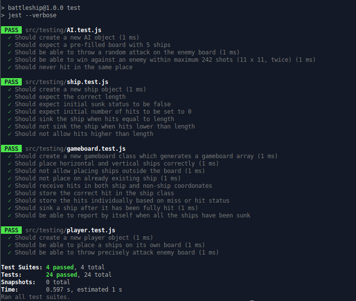

# Jana's Battleship Game 

## Project's Scope 



- The scope of this project was to build the Battleship game only throught **Test Driven Development**.
- It was unusual at first to write the **Unit Testing** and then start writing the code to make it pass, but it was a really fun and enjoyable experience in the end!
- I worked with Classes again for Ship/Player/Gameboard/AI constructors, and all the game checking logic happens inside of the Classes.
- After finishing the App, I learned how to manipulate the DOM to creaate the **User Interface**.

## Live Demo

- See the full live preview [here](https://janaiscoding.github.io/battleship/)

## Getting Started 

### Installing and running

```
git clone https://github.com/janaiscoding/battleship.git
cd battleship
npm install
delete the "type": "module", line from package.json
npx webpack
```

### Testing with jest

```npm run test```

## Project Details & Description 

- Play the classic game of Battleship against the AI!
- You can place your ships horizontally or vertically.
- You can't place your ship if another ship is taking that entire space.
- You can't interact with the computer board until you placed all your ships.
- You can't see the computer board's cells until you use your attacks.
- First to sink all the ships wins! You can play as many times as you want! 
- The hit icon used in this project is from [Font Awesome Icons](https://fontawesome.com/).
- This project is part of The Odin Project's [curriculum](https://www.theodinproject.com/lessons/node-path-javascript-battleship).

# Built with 

## Technologies 

- Vanilla JS
- CSS3
- HTML5

## Tools Used 

- Jest
- Visual Studio Code
- npm package manager
- Webpack Module Bundler
- Linux Terminal
- Git and Github

### Future plans for this project 

- Mobile Responsiveness (check)
